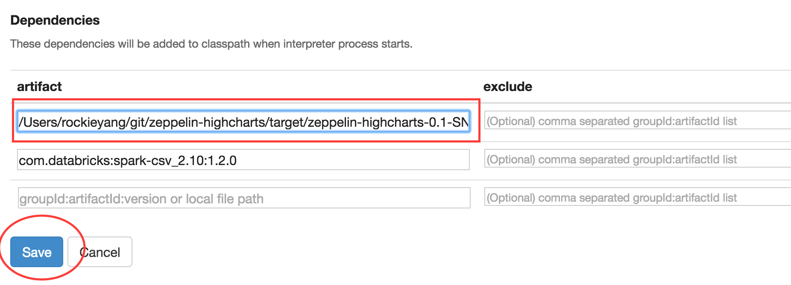
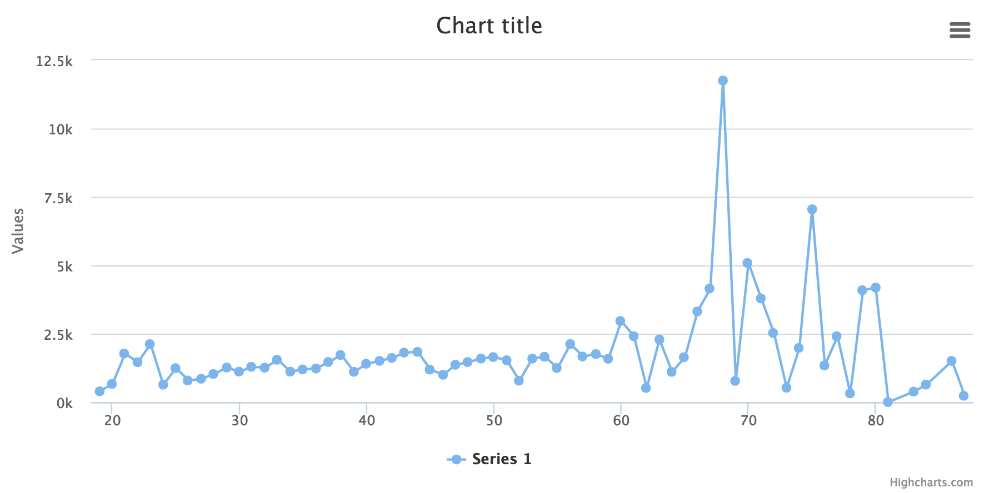

# Zeppelin Highcharts

Highcharts support in Apache Zeppelin

**You need a valid license if you use Highcharts for commercial use**

Please contact [Highcharts](https://shop.highsoft.com/) for license related issues.

## Get started

### Build the binary

    git clone https://github.com/knockdata/zeppelin-highcharts.git
    cd zeppelin-highcharts
    mvn clean package -DskipTests

### Add the binary to Zeppelin

> Goto Zeppelin -> `Interpreters`

> Scroll down to find `spark`

> Click `Edit`
 

> Scroll down to `Dependencies`

> Edit the `artifact` with the correct jar file 

> Click `Save`

### Load Highcharts

Paste the following code to a `Zeppelin` Paragraph and execute it 

	%angular
	

### Load the bank DataFrame 

Just need execute `Zeppelin Tutorial NoteBook` 

### Create your first chart with following code

Paste the following code and execute it

	%spark
	import com.knockdata.zeppelin.highcharts._
	import com.knockdata.zeppelin.highcharts.model._
	
	highcharts(bank)
	  .series("x" -> "age", "y" -> avg(col("balance")))
	  .orderBy(col("age")).plot()
	  
You will get the following graph

[What Data to Render](docs/series.md)
