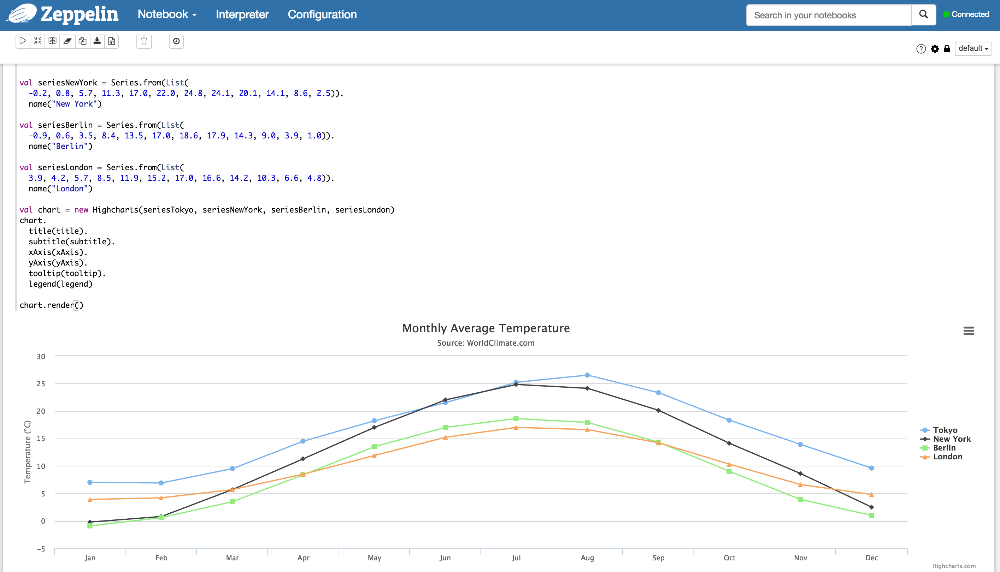
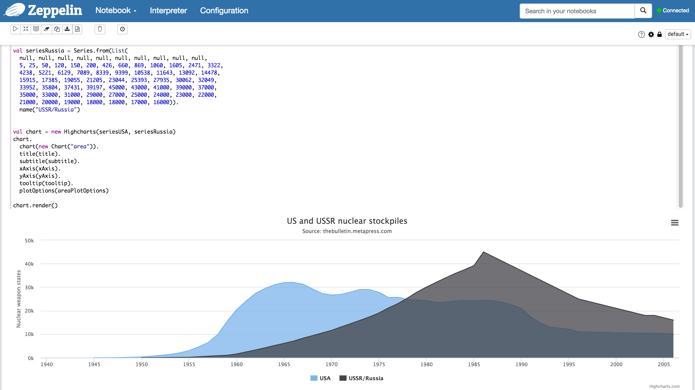
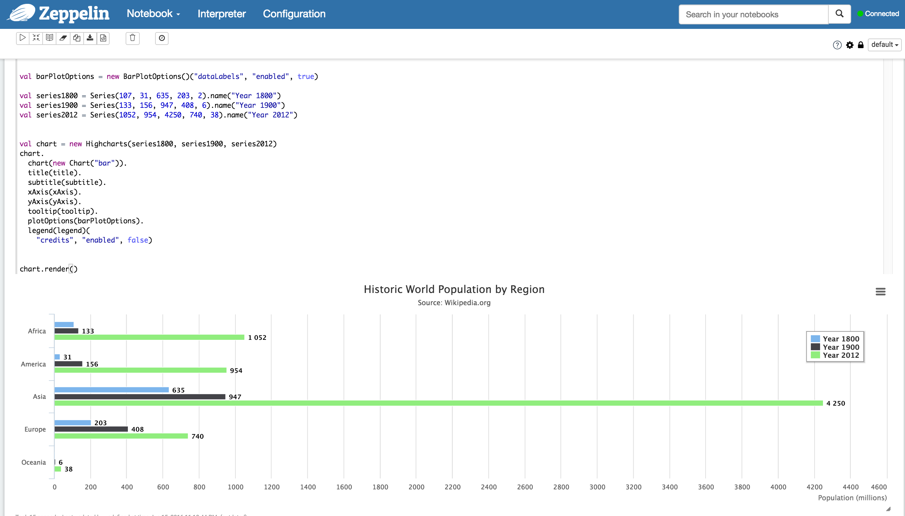

# zeppelin-highcharts

Add Highcharts support into Apache Zeppelin

The draft implementation has been finished. 

Now it is in verifing, wrapping up and cleaning the implemention.

It will be open sourced after the basic work down.

# Implemented Highchart demos

In order to verify the implementation, create the same effect as on Highchart  demos.

## Line Charts

### Line Basic
Implement the same with [highchart line basic demo](http://www.highcharts.com/demo/line-basic)

## Area Charts
###Area Basic
Implement the same with [highchart area basic demo](http://www.highcharts.com/demo/area-basic)

## Column and Bar charts
### Bar Basic
Implement the same with [highchart bar basic demo](http://www.highcharts.com/demo/line-basic)

# Planed Features

* From scala to highcharts, Ongoing(Line Basic, Area Basic, Bar Basic working), wrap up, to be published
* Spark frames/rdd -> highcharts
* Dynamic update data
* Animation 
* Drill down 
* Dynamic change chart type
* Dashboard using highcharts
* Theme support

TODO
double quote in json data
