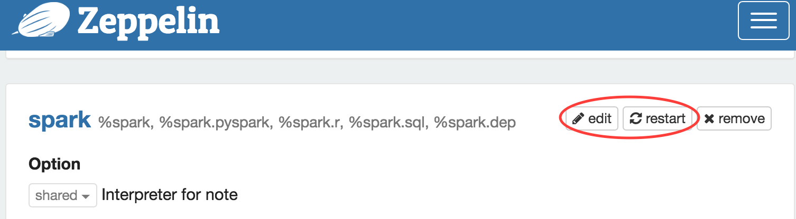

### Add the binary to Zeppelin

> Goto Zeppelin -> `Interpreters`

> Scroll down to find `spark`

> Click `Edit`

> Scroll down to `Dependencies`

> Edit the `artifact` with the correct jar file

`com.knockdata:spark-highcharts:0.6.1`

`net.liftweb:lift-json_2.11:2.6.3`

> Click `Save`

### Load Highcharts Javascript

Paste the following code to a `Zeppelin` Paragraph and execute it

	%angular
	

## License

spark-highcharts use Apache 2.0 License

However, the Highcharts JavaScript library that is included in this package is not free for commercial use. Please contact [Highcharts](https://shop.highsoft.com/) for license related issues.
